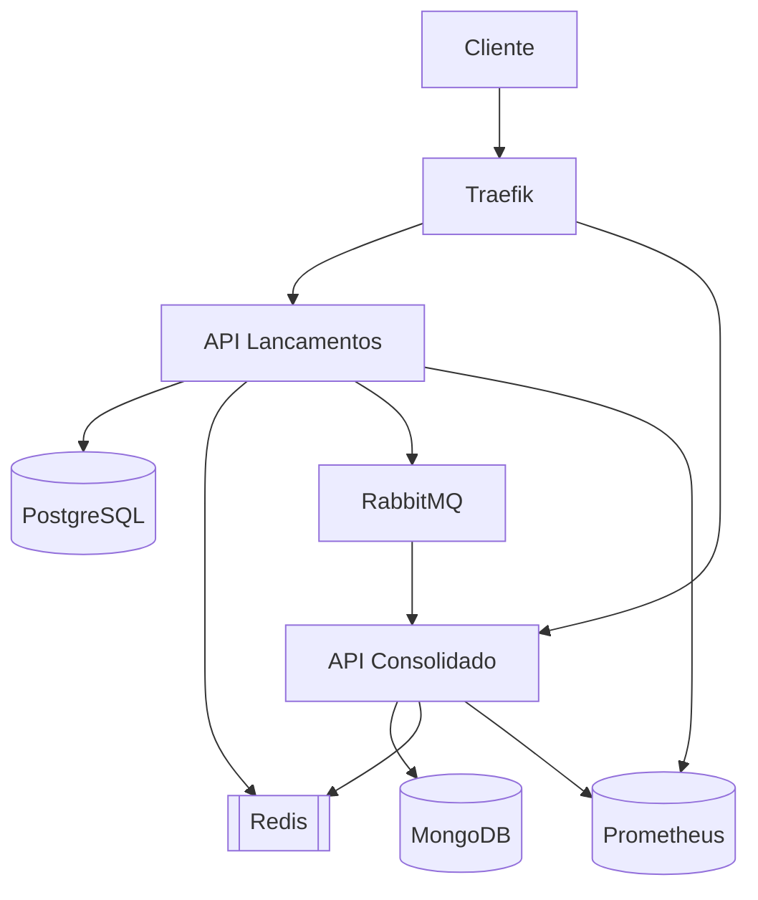

# Sistema de Fluxo de Caixa - Documentação

## 📋 Visão Geral

Este sistema foi desenvolvido para gerenciar lançamentos financeiros (débitos e créditos) e fornecer relatórios consolidados diários, atendendo aos requisitos especificados no documento de desafio.

## 🏗️ Arquitetura do Sistema

### Diagrama de Componentes

```
[Cliente]
  │
  ├─ [Traefik] (Proxy Reverso/Load Balancer)
  │   │
  │   ├─ [API Lancamentos] (C# .NET 9)
  │   │   ├─ PostgreSQL (Transações)
  │   │   └─ Redis (Cache)
  │   │
  │   └─ [API Consolidado] (C# .NET 9)
  │       ├─ MongoDB (Relatórios)
  │       └─ Redis (Cache)
  │
  └─ [RabbitMQ] (Comunicação Assíncrona)
```

### Relação com os Requisitos

| Requisito Documento | Implementação |
|---------------------|---------------|
| Controle de lançamentos | API Lancamentos com PostgreSQL |
| Consolidado diário | API Consolidado com MongoDB |
| Alta disponibilidade | Docker, Replicação, Traefik |
| Escalabilidade | Microsserviços, Redis Cache |
| Resiliência | Polly, Retry Patterns |
| Segurança | Autenticação Básica, HTTPS |

## 🚀 Como Executar o Sistema

### Pré-requisitos

- Docker 20.10+
- Docker Compose 2.0+
- .NET 9 SDK (para desenvolvimento)

### Passo a Passo

1. **Clone o repositório**:
   ```bash
   git clone https://github.com/mauropjjr/fluxo-caixa.git
   cd fluxo-caixa
   ```

2. **Configure as variáveis de ambiente**:
   ```bash
   # Edite o .env conforme necessário
   ```

3. **Inicie os serviços**:
   ```bash
   docker-compose up -d --build
   ```

4. **Acesse os serviços**:

   - API Lancamentos: `http://localhost:8080/swagger`
   - API Consolidado: `http://localhost:8090/swagger`
   - RabbitMQ Management: `http://localhost:15672`
   - Traefik Dashboard: `http://localhost:8080`

## 🔧 Tecnologias e Frameworks

| Tecnologia | Motivo da Escolha |
|------------|-------------------|
| C# .NET 9 | Linguagem requisitada, alta produtividade |
| PostgreSQL | ACID para transações financeiras |
| MongoDB | Schema-flexível para relatórios |
| Redis | Cache de alta performance |
| RabbitMQ | Mensageria confiável e amplamente adotada |
| Docker | Isolamento e portabilidade |
| Traefik | Proxy moderno com autodiscovery |
| FluentValidation | Validação robusta de inputs |

## 📊 Comunicação entre Componentes



1. **Fluxo de Lançamento**:
   - Cliente → Traefik → API Lancamentos → PostgreSQL
   - API Lancamentos → RabbitMQ → API Consolidado

2. **Fluxo de Consulta**:
   - Cliente → Traefik → API Consolidado → Redis (cache) → MongoDB

## 🚀 Implementações Futuras

### Monitoramento (Roadmap)

| Componente | Tecnologia | Objetivo |
|------------|------------|----------|
| Métricas | Prometheus + Grafana | Monitorar performance APIs |
| Logs | Loki + Grafana | Centralização de logs |
| Traces | Jaeger | Visualização de fluxos |
| Health Checks | Kubernetes | Resiliência |

**Diagrama de Monitoramento Futuro**:

```
[APIs] --> [Prometheus] --> [Grafana]
[APIs] --> [Loki]
[APIs] --> [Jaeger]
[Kubernetes] --> [Health Checks]
```

### Outras Melhorias Planejadas

1. **Autenticação**:
   - Migrar para JWT/OAuth2
   - Integração com Azure AD

2. **Frontend**:
   - Dashboard administrativo
   - Visualização gráfica do fluxo

3. **Integrações**:
   - Webhooks para notificações
   - API para bancos externos

4. **Performance**:
   - Cache em mais camadas
   - Leitura otimizada com Elasticsearch

## 🔍 Troubleshooting

Problemas comuns e soluções:

1. **Redis não removendo chaves**:
   - Verifique logs com `docker-compose logs redis`
   - Teste manualmente no Redis CLI:
     ```bash
     docker exec -it fluxo-caixa-redis-1 redis-cli KEYS "*"
     ```

2. **Erros de conexão**:
   - Verifique se todos serviços estão up:
     ```bash
     docker-compose ps
     ```

3. **Problemas no RabbitMQ**:
   - Acesse `http://localhost:15672` (guest/guest)
   - Verifique as filas e conexões

## 📄 Licença

MIT License - Copyright (c) 2025 Mauro Junior